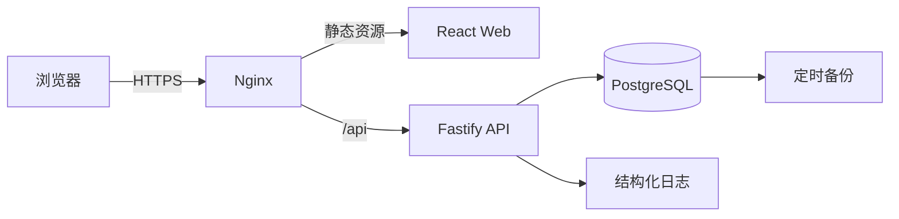

# 生产上线架构设计

**日期：** 2026-08-01  
**状态：** 已确认，待实施计划  
**适用项目：** 支付链接提交与工作室处理系统

## 1. 目标

将当前基于 React、Vite 和浏览器 `localStorage` 的可点击原型升级为可部署、可持续运行的生产系统，同时保持已经确认的用户端、管理员端和工作室端交互。

生产版本必须实现：

- 用户和管理员使用真实服务端身份认证。
- 工作室继续通过私密专属链接免登录进入。
- PostgreSQL 持久化所有业务数据。
- 服务端负责权限、校验、任务状态流转和并发控制。
- 支持单工作室当前业务，并为未来多工作室保留数据隔离边界。
- 提供 Docker Compose、Nginx、数据库迁移、备份、健康检查和部署文档。
- 前端不再使用 `localStorage` 保存业务数据或登录状态。

## 2. 已确认的产品边界

### 2.1 用户端

- 用户通过工作室专属注册链接注册。
- 注册后直接启用，不经过管理员审核。
- 用户使用账号和密码登录。
- 用户提交一条或多条支付链接，界面不设置提交条数上限。
- 所有任务只能进入该用户绑定的工作室。
- “支付链接”列表默认越上越新。
- 用户只能查看自己提交的任务、状态、时间线和工作室反馈。

### 2.2 工作室端

- 工作室暂不设置账号和密码。
- 工作室通过不可猜测的私密入口链接进入。
- 初次验证私密令牌后，服务端建立短期工作室会话并从地址栏移除令牌。
- 工作室任务队列默认越下越新，即最早任务在最上方。
- 打开排队任务时自动进入处理中。
- 可填写可选反馈，但必须选择处理成功或处理失败。
- 可通过“下一个任务”按完整队列向下切换，不受当前筛选和搜索影响。

### 2.3 管理员端

- 管理员使用独立账号和密码登录。
- 管理员查看全局统计、任务、用户和工作室配置。
- 管理员可启停用户、修改工作室名称、轮换注册链接和工作室私密入口。
- 管理员不代替工作室修改任务处理结果。

### 2.4 当前不包含

- 多工作室管理界面。
- 邮件、短信、第三方登录和找回密码邮件。
- 支付平台官方 API 对接。
- 从支付页面抓取官方二维码。
- 原型 `localStorage` 演示数据迁移到生产数据库。

## 3. 技术架构

采用 npm workspaces 管理前端、后端和共享契约：

```text
apps/
  web/                 React + Vite 前端
  api/                 Fastify API
packages/
  contracts/           Zod 请求响应模型和共享类型
prisma/
  schema.prisma        PostgreSQL 数据模型
  migrations/          数据库迁移
infra/
  nginx/               反向代理和静态站点配置
  backup/              PostgreSQL 备份脚本
  docker/              容器启动脚本
compose.yaml
docs/
  deployment.md
```

运行拓扑：



### 3.1 前端

- 保留 React、TypeScript、Vite、React Router 和现有亮色设计系统。
- 使用同源 `/api` 请求，不开放任意跨域访问。
- 使用 `fetch` 封装统一 API 客户端、错误模型和认证失效处理。
- React Context 只保存当前页面会话信息，不保存业务数据库副本。
- 列表使用服务端分页、筛选和搜索。

### 3.2 API

- Node.js LTS + Fastify + TypeScript。
- Prisma 管理 PostgreSQL 数据访问和迁移。
- Zod 契约由前后端共享，避免请求响应类型漂移。
- Pino 输出 JSON 结构化日志，并为每次请求生成请求编号。
- 所有写操作在服务端进行权限判断和状态校验。

### 3.3 PostgreSQL

- 使用 PostgreSQL 16。
- 生产容器使用独立持久卷。
- 时间统一保存为 UTC，前端按浏览器时区显示。
- 数据表通过外键、唯一索引和检查约束保证隔离与一致性。

## 4. 数据模型

### 4.1 Studio

```ts
type Studio = {
  id: string
  name: string
  registrationCodeHash: string
  accessTokenHash: string
  tokenVersion: number
  enabled: boolean
  createdAt: Date
  updatedAt: Date
}
```

- 注册码和工作室访问令牌只保存 SHA-256 哈希。
- 原始值仅在创建或轮换时返回一次。
- `tokenVersion` 用于轮换令牌后立即使旧工作室会话失效。

### 4.2 User

```ts
type User = {
  id: string
  username: string
  normalizedUsername: string
  passwordHash: string
  studioId: string
  enabled: boolean
  createdAt: Date
  updatedAt: Date
}
```

- 用户名使用规范化字段做唯一约束。
- 密码只保存 Argon2id 哈希。
- 停用用户后，其全部用户会话立即撤销。

### 4.3 Admin

```ts
type Admin = {
  id: string
  username: string
  normalizedUsername: string
  passwordHash: string
  enabled: boolean
  passwordChangedAt: Date
  createdAt: Date
  updatedAt: Date
}
```

- 首个管理员由一次性初始化命令创建，不在代码或镜像中保存默认密码。

### 4.4 Task

```ts
type Task = {
  id: string
  publicId: string
  queueSeq: bigint
  url: string
  status: 'queued' | 'processing' | 'success' | 'failed'
  userId: string
  studioId: string
  submittedAt: Date
  processingStartedAt?: Date
  completedAt?: Date
  feedback?: string
  version: number
}
```

- `queueSeq` 使用数据库递增序列，作为稳定队列顺序。
- 用户端按 `queueSeq DESC` 查询，最新任务在上方。
- 工作室端按 `queueSeq ASC` 查询，最新任务在下方。
- `publicId` 使用不可预测的公开任务编号，不暴露数据库序列。
- `version` 用于乐观并发控制。

### 4.5 Session

```ts
type Session = {
  id: string
  tokenHash: string
  principalType: 'user' | 'admin' | 'studio'
  principalId: string
  studioTokenVersion?: number
  expiresAt: Date
  lastSeenAt: Date
  createdAt: Date
}
```

- 浏览器 Cookie 保存高强度随机原始令牌。
- 数据库只保存令牌 SHA-256 哈希。
- 用户、管理员和工作室使用独立 Cookie 名称与权限范围。

### 4.6 AuditLog

```ts
type AuditLog = {
  id: bigint
  actorType: 'user' | 'admin' | 'studio' | 'system'
  actorId?: string
  action: string
  targetType?: string
  targetId?: string
  metadata?: Record<string, unknown>
  ipAddress?: string
  userAgent?: string
  createdAt: Date
}
```

审计日志记录登录、注册、启停用户、令牌轮换、任务打开、任务完成和部署初始化等关键动作。日志不保存密码、会话令牌或完整敏感请求体。

### 4.7 SubmissionBatch

```ts
type SubmissionBatch = {
  id: string
  userId: string
  idempotencyKey: string
  requestedCount: number
  createdCount: number
  createdAt: Date
}
```

用于防止网络重试导致同一批链接重复创建。

## 5. 身份认证和权限

### 5.1 Cookie 会话

- Cookie 设置 `HttpOnly`、`Secure`、`SameSite=Lax`。
- 用户和管理员会话默认有效期 7 天，支持主动退出和服务端撤销。
- 工作室会话默认有效期 12 小时。
- 会话令牌使用密码学安全随机数，数据库只保存哈希。
- 每次请求校验账号、工作室和令牌版本是否仍有效。

### 5.2 CSRF 与请求来源

- 写接口校验 `Origin` 和同源请求头。
- 使用 CSRF Token 保护 Cookie 认证下的状态修改请求。
- Nginx 和 API 只允许配置中的正式域名。

### 5.3 工作室私密入口

1. 管理员生成至少 256 位随机访问令牌。
2. 分享链接格式为 `/studio/access/{TOKEN}`。
3. 前端向 API 交换短期工作室会话。
4. API 验证哈希后设置工作室 Cookie。
5. 浏览器跳转到 `/studio/workbench`，地址栏不再保留原始令牌。
6. 管理员轮换令牌时增加 `tokenVersion`，旧链接和旧会话立即失效。

### 5.4 注册入口

- 注册链接使用不可预测的注册码。
- 注册码验证通过后，用户自动绑定该工作室。
- 用户名、密码和请求频率由 API 校验。
- 注册接口不返回注册码哈希或工作室私密访问令牌。

### 5.5 权限矩阵

| 操作 | 用户 | 工作室 | 管理员 |
|---|---:|---:|---:|
| 查看自己的任务 | 是 | 否 | 是 |
| 提交任务 | 是 | 否 | 否 |
| 查看所属工作室全部任务 | 否 | 是 | 是 |
| 打开并处理任务 | 否 | 是 | 否 |
| 启停用户 | 否 | 否 | 是 |
| 轮换专属链接 | 否 | 否 | 是 |
| 查看审计日志 | 否 | 否 | 是 |

## 6. 任务状态与并发控制

状态机保持：

```text
queued -> processing -> success
                     -> failed
```

### 6.1 打开任务

- API 在事务中执行条件更新：仅当状态为 `queued` 时更新为 `processing` 并写入开始时间。
- 若任务已是 `processing`，返回当前任务且不覆盖原开始时间。
- 若任务已结束，按只读任务返回。
- 任务必须属于当前工作室会话对应的工作室。

### 6.2 完成任务

- 只有 `processing` 可以进入 `success` 或 `failed`。
- 使用 `version` 条件更新，避免两个操作员同时完成同一任务。
- 并发冲突返回 HTTP 409，并要求前端刷新任务状态。
- 可选反馈在服务端去除首尾空白并设置长度限制。

### 6.3 下一个任务

- 根据完整工作室队列查询 `queueSeq > 当前 queueSeq` 的最小值。
- 不受前端搜索和状态筛选影响。
- 下一条为排队中时，复用打开任务事务自动进入处理中。
- 没有下一条时返回空结果，前端禁用按钮。

## 7. 支付链接提交

### 7.1 用户体验

- 界面继续允许一次粘贴任意数量的链接，不显示业务条数上限。
- 空行自动忽略，同次重复链接自动合并。
- 无效链接在提交前明确标记。

### 7.2 服务端保护

- 仅接受 `http:` 和 `https:` URL。
- URL、反馈、用户名和请求体均设置合理字节长度限制。
- 前端将大批量链接自动分块提交，每个 API 请求最多 200 条。
- 一个用户操作使用同一批次编号，界面持续显示已提交数量和失败分块。
- 每个分块使用独立幂等键，网络重试不会重复创建。
- 此分块限制属于传输保护，不构成用户可见的单次提交总量限制。

### 7.3 二维码

- 详情中的二维码由系统将任务的完整 `url` 编码生成。
- 二维码不代表支付平台官方下发的图片。
- 服务端和前端均不抓取第三方支付页面。

## 8. API 设计

统一前缀：`/api/v1`

### 8.1 公共和认证

```text
POST /auth/register/{registrationCode}
POST /auth/user/login
POST /auth/user/logout
GET  /auth/user/session
POST /auth/admin/login
POST /auth/admin/logout
GET  /auth/admin/session
POST /auth/studio/exchange/{accessToken}
POST /auth/studio/logout
GET  /auth/studio/session
GET  /csrf
```

### 8.2 用户任务

```text
POST /user/task-batches
POST /user/task-batches/{batchId}/chunks
GET  /user/tasks
GET  /user/tasks/{publicId}
```

列表支持游标分页、状态筛选和链接或任务编号搜索。

### 8.3 工作室任务

```text
GET  /studio/tasks
GET  /studio/tasks/{publicId}
POST /studio/tasks/{publicId}/open
POST /studio/tasks/{publicId}/complete
GET  /studio/tasks/{publicId}/next
```

### 8.4 管理员

```text
GET   /admin/dashboard
GET   /admin/tasks
GET   /admin/tasks/{publicId}
GET   /admin/users
PATCH /admin/users/{id}/enabled
GET   /admin/studio
PATCH /admin/studio
POST  /admin/studio/rotate-registration-code
POST  /admin/studio/rotate-access-token
GET   /admin/audit-logs
```

### 8.5 错误格式

```ts
type ApiError = {
  error: {
    code: string
    message: string
    requestId: string
    fields?: Record<string, string>
  }
}
```

前端根据稳定错误码显示登录失败、账号停用、并发冲突、会话失效和字段错误。

## 9. 分页、搜索与实时状态

- 任务和审计日志默认每页 50 条。
- 使用 `queueSeq` 游标分页，避免数据增长后使用大偏移量。
- 搜索字段建立必要索引。
- 第一版使用 10 秒轮询刷新统计和列表，不引入 WebSocket。
- 抽屉打开时刷新当前任务，避免显示过期状态。

## 10. 安全加固

- Argon2id 密码哈希，参数通过环境变量配置并提供安全默认值。
- Fastify Helmet 安全响应头。
- Content Security Policy 仅允许本站资源。
- `Referrer-Policy: no-referrer`，避免私密入口令牌外泄。
- 登录、注册、工作室令牌交换和任务提交分别限流。
- Nginx 设置请求体大小、连接超时和基础速率限制。
- 数据库用户使用最小权限，不允许从公网直接访问 PostgreSQL。
- `.env`、备份和日志不进入 Git。
- 生产环境禁止演示账号、默认密码和重置演示数据接口。
- 审计日志记录关键动作，但对敏感字段脱敏。

## 11. 可观测性与运维

### 11.1 健康检查

```text
GET /health/live   进程存活
GET /health/ready  数据库和迁移状态正常
```

Docker Compose 和 Nginx 使用就绪检查判断 API 是否可接收流量。

### 11.2 日志

- API 输出 JSON 日志到标准输出。
- 日志包含时间、级别、请求编号、路由、状态码和耗时。
- 不记录密码、Cookie、CSRF Token、访问令牌和完整支付链接查询参数。

### 11.3 备份

- 每日执行 `pg_dump` 压缩备份。
- 默认保留最近 7 天本地备份。
- 部署文档要求配置至少一个异机或对象存储副本。
- 提供恢复演练命令并在上线前实际验证一次。

## 12. Docker 与 Nginx

`compose.yaml` 包含：

- `web`：构建 React 静态资源。
- `api`：运行 Fastify 和 Prisma。
- `postgres`：PostgreSQL 16 与持久卷。
- `nginx`：TLS 终止、静态资源和 `/api` 反向代理。
- `backup`：按计划运行数据库备份脚本。

部署变量通过 `.env.production` 注入，并提供不含真实秘密的 `.env.example`。

域名准备后使用 Let's Encrypt 或服务器已有证书启用 HTTPS。HTTP 必须重定向 HTTPS。

## 13. 数据初始化与迁移

- Prisma migration 是数据库结构的唯一来源。
- 提供 `npm run db:migrate:deploy` 用于生产迁移。
- 提供一次性 `npm run admin:create` 初始化首个管理员。
- 提供一次性 `npm run studio:create` 初始化唯一工作室并输出注册链接和工作室私密入口一次。
- 初始化命令支持重复执行保护，不覆盖已存在数据。
- `localStorage` 演示数据不自动导入生产环境。

## 14. 测试策略

### 14.1 单元测试

- URL 解析、状态机、密码策略、会话令牌和分页游标。
- 保留前端组件与页面交互测试。

### 14.2 API 集成测试

- 使用独立 PostgreSQL 测试数据库。
- 覆盖注册、登录、退出、权限隔离、任务批量提交、任务打开、完成和并发冲突。
- 验证用户不能读取其他用户任务，工作室不能读取其他工作室任务。
- 验证令牌轮换后旧工作室会话失效。

### 14.3 端到端冒烟测试

- 用户注册并登录。
- 用户提交多条链接。
- 工作室打开第一条并处理成功。
- 使用“下一个任务”处理下一条。
- 用户查看状态和反馈。
- 管理员查看统计并停用用户。

### 14.4 发布门禁

上线镜像必须通过：

```text
类型检查
单元测试
API 集成测试
前端生产构建
容器健康检查
数据库迁移检查
备份恢复演练
```

## 15. 上线流程

1. 在本地完成生产代码和自动化测试。
2. 构建并启动 Docker Compose 开发生产镜像。
3. 初始化数据库、管理员和唯一工作室。
4. 验证完整三端业务流程。
5. 准备服务器、域名、DNS 和 HTTPS。
6. 配置生产环境变量与防火墙。
7. 部署容器并执行数据库迁移。
8. 完成健康检查、备份恢复和日志检查。
9. 轮换初始化产生的临时密码和令牌。
10. 开放正式入口并持续观察错误日志。

## 16. 验收标准

1. 业务数据全部保存在 PostgreSQL，刷新或更换浏览器后仍可访问。
2. 用户、管理员和工作室只能访问各自权限范围内的数据。
3. 密码、注册码、工作室访问令牌和会话令牌均不以明文保存。
4. 用户可通过专属链接注册并直接登录使用。
5. 用户界面可提交任意数量链接，前端自动分块且网络重试不重复创建。
6. 用户支付链接默认越上越新，工作室队列默认越下越新。
7. 两个工作室操作员同时处理同一任务时不会产生重复完成或状态覆盖。
8. “下一个任务”使用完整队列并正确处理末尾状态。
9. 管理员可启停用户并轮换注册链接和工作室访问令牌。
10. 生产环境不存在演示密码、演示重置入口或业务 `localStorage` 数据。
11. Docker Compose 能在新环境完成构建、迁移、启动和健康检查。
12. 数据库备份可成功恢复到独立验证数据库。
13. 所有发布门禁通过后才允许正式开放访问。
